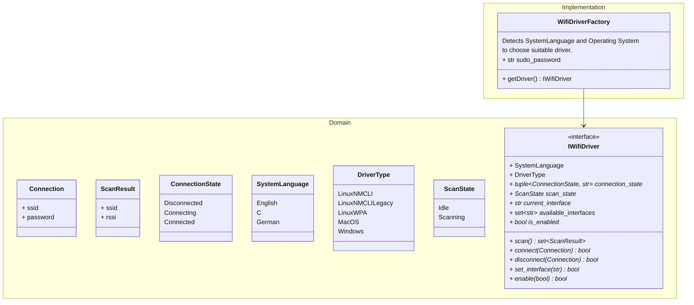

# Design Documentation

- follow somewhat clean architecture
- main goal is aysnc. Maybe provide sync wrapper.

We're currently only supporting english. Given the above simple architecture, any additional languages will need to
completely reimplement an `IWifiDriver` for each OS. Once / if more languages are supported it might make sense to
create per-OS interfaces such that the different languages only need to implement a few hooks.