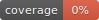

PyWiFiCli
=====================

TODO

.. image:: https://img.shields.io/badge/License-MIT-blue.svg
    :target: https://lbesson.mit-license.org/
    :alt: MIT License

.. image:: https://img.shields.io/pypi/v/TODO
    :target: https://pypi.org/project/TODO/
    :alt: PyPI

.. image:: https://img.shields.io/badge/code%20style-black-000000.svg
    :target: https://github.com/psf/black
    :alt: Black

Summary
-------

TODO

Features
--------

TODO

Getting Started
---------------

TODO

Development
-----------

TODO

.. toctree::
    :maxdepth: 4
    :caption: Contents:

    api
